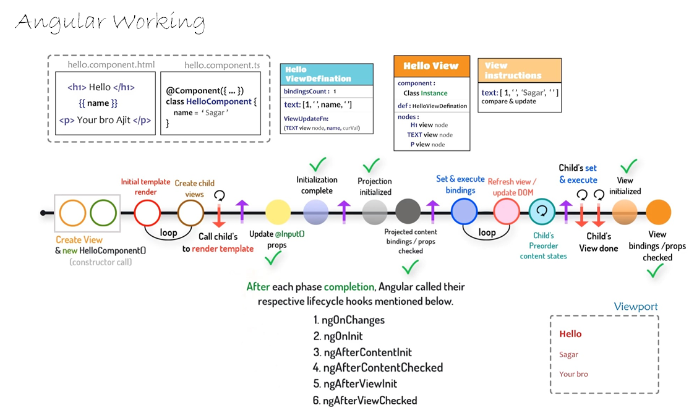

- #Angular
- 
  
  The image depicts the inner workings of an Angular application, specifically focusing on the data flow between components and the DOM manipulation process. Here's a breakdown of the key stages:
	- 1. **Initial Template:**
		- The process begins with the `hello.component.html` file, which represents the component's template containing HTML code with placeholders for dynamic data binding.
	-
	- 2. **Create View & New HelloComponent Instance:**
		- Angular creates a view (`ViewDefinition`) and a new instance of the `HelloComponent` class based on the component's template.
	-
	- 3. **View Definition and Instructions:**
		- The `ViewDefinition` holds instructions on how to render the component's view and includes properties like bindings and nodes.
	-
	- 4. **Component Class (`HelloComponent.ts`):**
		- The `HelloComponent.ts` file contains the component's TypeScript code, including the `name` property that holds the data to be displayed.
	-
	- 5. **Data Binding:**
		- Angular performs two-way data binding, synchronizing the `name` property in the component class (`HelloComponent.ts`) with the corresponding placeholder in the template (`hello.component.html`).
	-
	- 6. **Compare & Update:**
		- Angular compares the current view state with the previous state and updates the DOM accordingly. In this case, it inserts the value of the `name` property (`'Sagar'`) into the `<h1>` element.
	-
	- 7. **Refresh View / View Update:**
		- The updated view is reflected in the browser, displaying the data from the component class.
	-
	- 8. **Lifecycle Hooks:**
		- After each stage's completion, Angular calls lifecycle hooks (like `ngOnChanges`, `ngOnInit`, etc.) to perform actions at specific points in the component's lifecycle.
	-
- **Additional Notes:**
- The `Child's set & execute` and `Child's bindings/props` sections likely refer to potential child components within the main component.
- The viewport represents the web browser's viewport where the application is displayed.