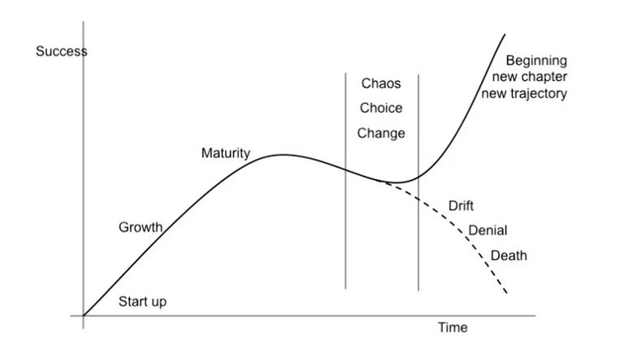

- #ProductManagement
- The Sigmoid Curve describes how products grow, stabilize, and decline over time. It starts slowly, then grows rapidly, peaks, levels off, and eventually declines. Understanding this helps businesses plan for the future of their products.
- Example to understand:
	- imagine you have a new toy that everyone is excited about. At first, when you show it to your friends, they all want to play with it, and you feel really happy. This is like the beginning of the Sigmoid Curve.
	- As time goes on, more and more friends start to play with the toy. You might notice that it's not as exciting as it was at the beginning. Some friends might even start to lose interest. This is the top of the curve, where things start to slow down.
	- But then, something interesting happens. You figure out a new way to play with the toy, or maybe there's a new version of it that's even cooler. Suddenly, everyone wants to play with it again! This is like the second part of the curve, where things start to pick up again.
	- So, the Sigmoid Curve is like the ups and downs of how popular something is. It starts off really exciting, then it slows down, but with some changes or improvements, it can become exciting again. This happens with lots of things, not just toys, but also with products like gadgets and even ideas!
- 